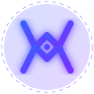

<<<<<<< HEAD
# Moire Tech Website

A production-ready website for Moire Tech built with Next.js 14, Tailwind CSS, and Framer Motion. Features a futuristic cyberpunk aesthetic with dark themes, glass morphism effects, and advanced animations.



## 🚀 Features

- **Next.js 14** with App Router and TypeScript
- **Tailwind CSS** with custom brand design tokens
- **Framer Motion** for advanced animations and transitions
- **Particle.js** for interactive background effects
- **Glass Morphism** UI design
- **Dark Futuristic** aesthetic (Bloomberg Terminal meets Cyberpunk)
- **Mobile Responsive** with hamburger navigation
- **SEO Optimized** with metadata and sitemap
- **Vultr Deployment Ready** with Docker & Nginx

## 📁 Project Structure

```
moiretech-website/
├── app/                    # Next.js app router pages
│   ├── layout.tsx         # Root layout with fonts & metadata
│   ├── page.tsx           # Homepage (all sections)
│   └── globals.css        # Global styles & Tailwind config
├── components/            # React components
│   ├── Navbar.tsx         # Glass morphism navigation
│   ├── Hero.tsx           # Full-viewport hero with particles
│   ├── About.tsx          # Stats counters & company story
│   ├── Services.tsx       # Three pillar services cards
│   ├── Products.tsx       # Product showcase carousel
│   ├── Training.tsx       # Cybersecurity training terminal
│   ├── WhyUs.tsx          # Feature grid with animations
│   ├── Contact.tsx        # Contact form & info
│   ├── Footer.tsx         # Site footer
│   ├── AIConcierge.tsx   # Ruflo AI assistant placeholder
│   ├── ParticleBackground.tsx # Interactive particle background
│   ├── AnimatedCounter.tsx   # Scroll-triggered counters
│   └── TiltCard.tsx          # 3D tilt card component
├── public/                # Static assets
│   ├── logo.svg          # Moire Tech M logo
│   ├── robots.txt        # SEO robots configuration
│   └── sitemap.xml       # SEO sitemap
├── deployment/           # Production deployment files
│   ├── Dockerfile        # Node.js production Dockerfile
│   ├── nginx.conf       # Nginx reverse proxy configuration
│   ├── docker-compose.yml # Multi-container deployment
│   └── .env.example      # Environment variables template
└── package.json          # Dependencies & scripts
```

## 🎨 Design System

### Colors
```css
brand-black:     #080808      /* Deep black background */
brand-dark:      #0D0D1A      /* Dark navy accent */
brand-blue:      #3B5EFF      /* Electric blue primary */
brand-violet:    #7B2FFF      /* Purple secondary */
brand-glow:      #5B8DFF      /* Glow/highlight color */
brand-glass:     rgba(255,255,255,0.04) /* Glass morphism */
```

### Typography
- **Headings**: Orbitron (futuristic, tech-focused)
- **Body**: DM Sans (clean, readable)

### Animations
- Particle mesh hero background
- Typewriter text cycling
- Scroll-triggered section reveals
- 3D card tilt on hover
- Number counter animations
- Logo glow pulse effects
- Button shimmer sweeps

## 🛠️ Installation & Development

1. **Clone repository**
   ```bash
   git clone https://github.com/moiretech/website.git
   cd website
   ```

2. **Install dependencies**
   ```bash
   npm install
   ```

3. **Set up environment variables**
   ```bash
   cp .env.example .env
   # Edit .env with your configuration
   ```

4. **Run development server**
   ```bash
   npm run dev
   ```
   Open [http://localhost:3000](http://localhost:3000)

5. **Build for production**
   ```bash
   npm run build
   npm start
   ```

## 🐳 Docker Deployment (Vultr Ready)

### Quick Start
```bash
# Build and run with Docker Compose
docker-compose up -d

# View logs
docker-compose logs -f

# Stop containers
docker-compose down
```

### Production Deployment Steps
1. **Build Docker image**
   ```bash
   docker build -t moiretech-website .
   ```

2. **Set environment variables**
   ```bash
   cp .env.example .env.production
   # Configure production values
   ```

3. **Deploy with Docker Compose**
   ```bash
   docker-compose -f docker-compose.yml --env-file .env.production up -d
   ```

4. **Configure SSL** (optional)
   - Place SSL certificates in `./ssl/` directory
   - Update `nginx.conf` with SSL paths
   - Uncomment SSL configuration in nginx.conf

## 📈 SEO & Performance

- **Metadata**: Open Graph, Twitter Cards, structured data
- **Sitemap**: Auto-generated XML sitemap
- **Robots.txt**: Custom crawler directives
- **Performance**: Image optimization, code splitting
- **Accessibility**: Semantic HTML, ARIA labels
- **Analytics**: Google Analytics ready (add ID in .env)

## 🔧 Technical Stack

### Core
- **Next.js 14** - React framework with App Router
- **TypeScript** - Type-safe JavaScript
- **Tailwind CSS 4** - Utility-first CSS framework
- **Framer Motion** - Animation library

### Animations & Effects
- **@tsparticles/react** - Particle background effects
- **Lucide React** - Icon library
- **React Icons** - Additional icon sets

### Deployment
- **Docker** - Containerization
- **Nginx** - Reverse proxy & caching
- **Node.js 20** - Runtime environment

## 🎯 Pages & Sections

1. **Hero Section** - Full-viewport with animated particles
2. **About Section** - Stats counters & company story
3. **Services Section** - Three pillar cards with 3D tilt
4. **Products Section** - Horizontal showcase carousel
5. **Training Section** - Terminal-style cybersecurity training
6. **Why Us Section** - Feature grid with staggered animations
7. **Contact Section** - Form with validation & social links
8. **Footer** - Navigation, social links, legal info

## 🤖 AI Integration (Phase 2)

The site includes a placeholder **AI Concierge** button powered by **[Ruflo](https://github.com/ruvnet/ruflo)** multi-agent orchestration. This positions Moire Tech as forward-thinking in agentic AI technology.

## 📄 License

Copyright © 2026 Moire Tech. All rights reserved.

## 🙏 Credits

- Design: Inspired by Bloomberg Terminal & Cyberpunk aesthetics
- Icons: Lucide React
- Particles: tsparticles
- Animations: Framer Motion
- Fonts: Google Fonts (Orbitron, DM Sans)

## 🆘 Support

For technical issues or feature requests:
- Create an issue on GitHub
- Email: tech@moire.tech
- Documentation: [docs.moire.tech](https://docs.moire.tech)

---

**Moire Tech** - Where Code Meets Defence 🛡️
=======
# Moiretech-Website
>>>>>>> 8dc649a68fcaf5971f3bc1efba10020b5fe5053e
